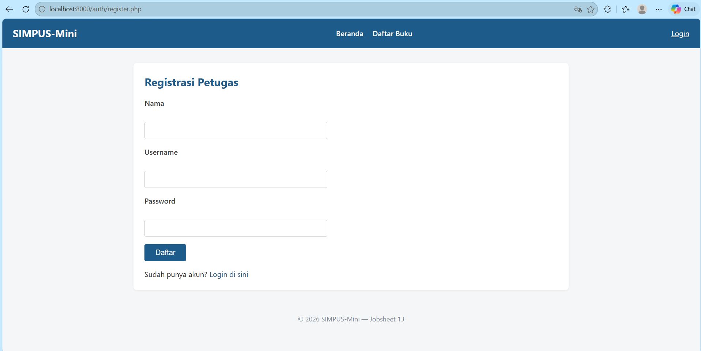
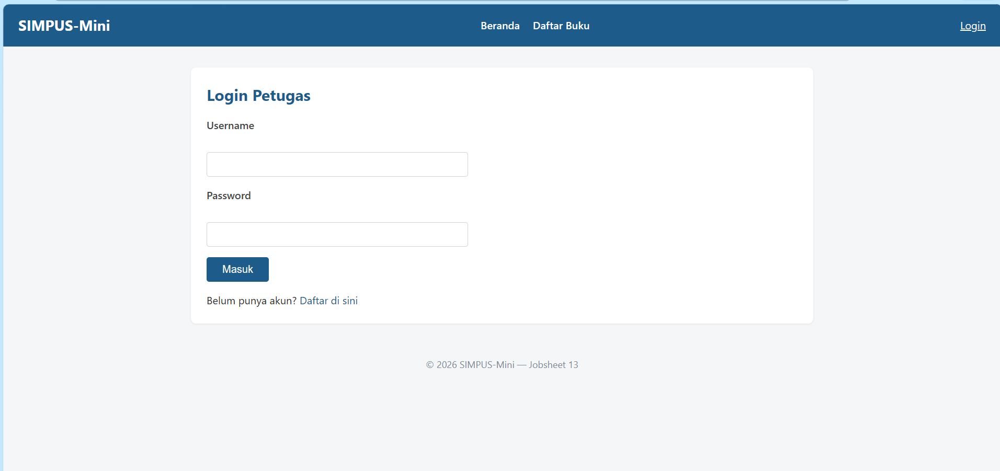
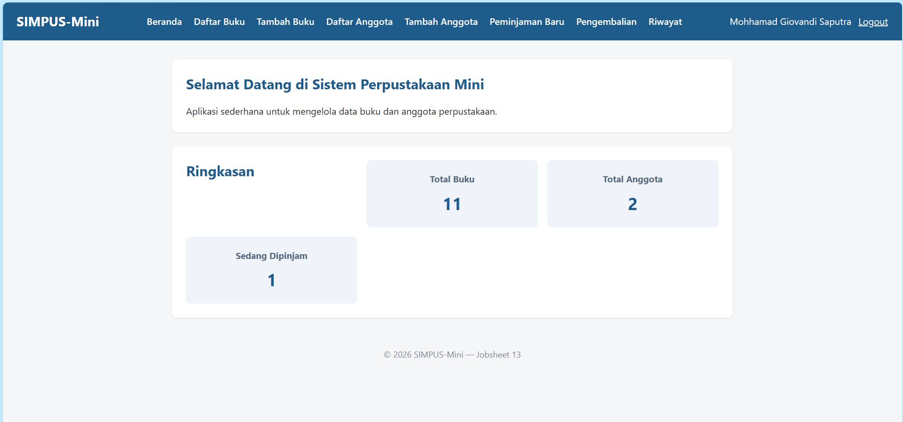
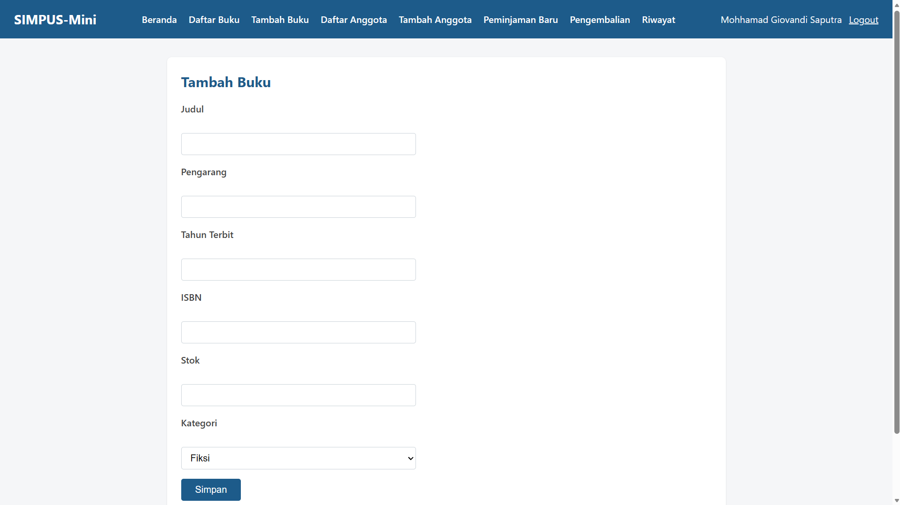
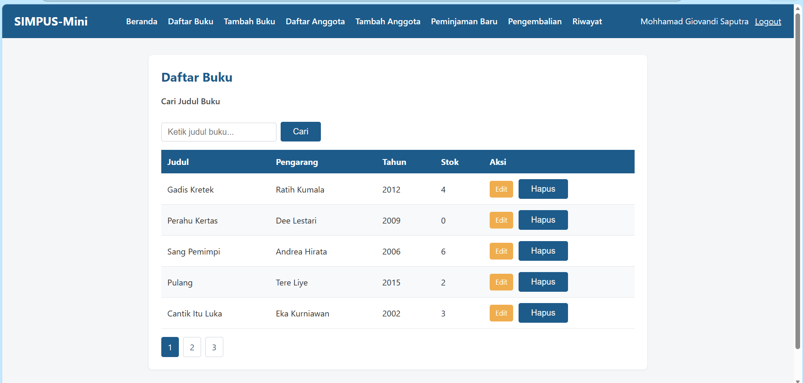
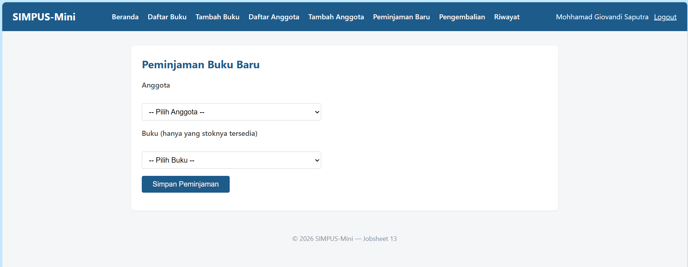
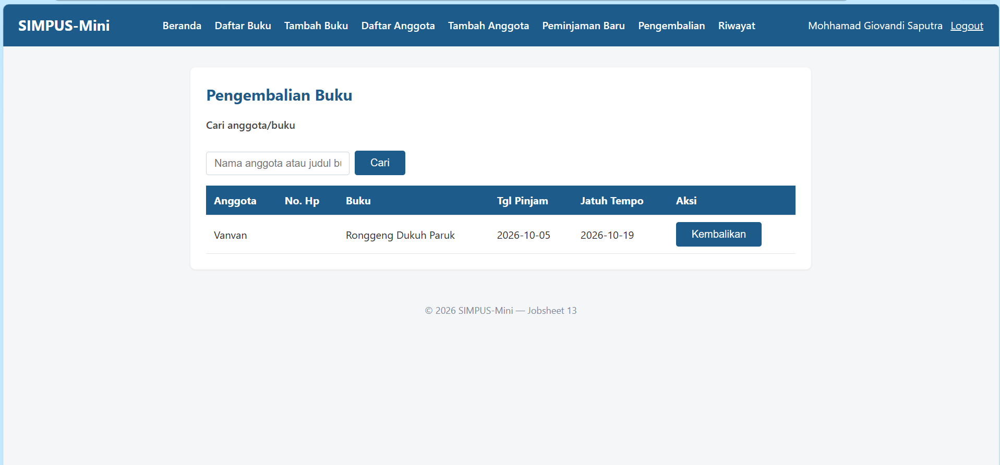
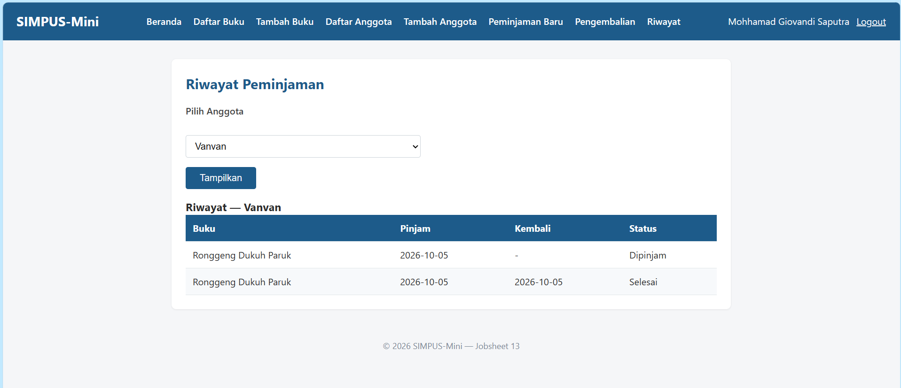

# Manual Pengguna — SIMPUS-Mini

> Panduan penggunaan aplikasi Sistem Informasi Perpustakaan Mini (SIMPUS-Mini) untuk petugas perpustakaan dan pengguna akhir, dilengkapi dengan tangkapan layar antarmuka sistem.
>
> URL contoh di bawah menggunakan `http://localhost:8000/...` (PHP built-in server). Jika menjalankan via Laragon atau Virtual Host, sesuaikan domainnya.

---

## 1. Registrasi & Login Petugas

1. Buka `http://localhost:8000/auth/register.php`.
2. Isi Nama, Username, Password (minimal 6 karakter), lalu klik **Daftar**.

   

3. Setelah registrasi berhasil, sistem akan mengarahkan ke halaman Login. Masukkan username & password yang baru dibuat, lalu klik **Masuk**.

   

4. Setelah berhasil login, navbar akan menampilkan nama petugas yang sedang aktif dan tombol **Logout**, serta menu operasional tambahan (Tambah Buku, Daftar/Tambah Anggota, Peminjaman, Pengembalian, Riwayat) yang tidak dapat diakses oleh Tamu/Pengunjung umum.

   

---

## 2. Mengelola Data Buku

1. Klik menu **Tambah Buku**, lengkapi formulir (Judul, Pengarang, Tahun, ISBN, Stok, Kategori), lalu klik **Simpan**.

   

2. Data buku yang tersimpan akan langsung muncul pada **Daftar Buku**. Petugas dapat memanfaatkan kolom pencarian untuk menyaring koleksi berdasarkan judul.

   

3. Klik tombol **Edit** pada baris buku untuk memperbarui data, atau tombol **Hapus** untuk menghapus buku (sistem akan memunculkan dialog konfirmasi JavaScript sebelum eksekusi).

---

## 3. Mengelola Data Anggota

Alur pengelolaan anggota sama dengan pengelolaan buku:
* Akses menu **Tambah Anggota** → lengkapi data profil (Nama, No Anggota, Alamat, No HP) → simpan data.
* Data anggota akan terdaftar pada **Daftar Anggota**, lengkap dengan opsi Edit dan Hapus per baris data.

---

## 4. Meminjamkan Buku

1. Klik menu **Peminjaman Baru**.
2. Pilih **Anggota** dan **Buku** yang ingin dipinjam (hanya buku dengan stok tersedia $\ge 1$ yang muncul pada daftar pilihan), lalu klik **Simpan Peminjaman**.

   

3. Kembali ke **Beranda** — statistik kartu "Sedang Dipinjam" akan bertambah, dan stok buku yang bersangkutan pada katalog berkurang 1 secara otomatis.

---

## 5. Mengembalikan Buku

1. Klik menu **Pengembalian**.
2. Cari data transaksi peminjaman aktif berdasarkan nama anggota atau judul buku, kemudian klik tombol **Kembalikan** pada baris data yang sesuai.

   

3. Stok buku terkait akan bertambah kembali 1 unit, dan data transaksi tersebut otomatis dikeluarkan dari daftar peminjaman aktif.

---

## 6. Melihat Riwayat Peminjaman

1. Klik menu **Riwayat**.
2. Pilih nama anggota dari menu dropdown, kemudian klik **Tampilkan**.
3. Tabel akan menyajikan seluruh rekam jejak peminjaman anggota terpilih beserta statusnya (`dipinjam` atau `selesai`).

   

---

## 7. Logout

Klik tombol **Logout** pada sisi kanan atas navbar untuk mengakhiri sesi kerja. Setelah logout:
* Sesi pengguna dihancurkan di server.
* Menu-menu internal petugas akan otomatis disembunyikan.
* Jika pengunjung tamu mencoba mengakses URL petugas secara langsung, sistem guard `auth.php` akan otomatis menolak dan mengalihkan halaman ke form Login.
