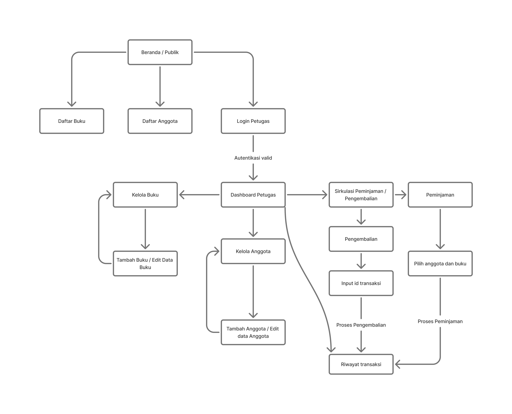

# Wireframe dan User Flow - SIMPUS-Mini

Dokumen ini berisi rancangan alur pengguna (*User Flow*) dan *wireframe* berbasis teks untuk fitur-fitur yang akan dibangun pada tahap pengembangan selanjutnya, meliputi: Login, Dashboard Petugas, Peminjaman, Pengembalian, dan Riwayat.

---

## 1. User Flow (Alur Pengguna)



### A. Alur Login & Dashboard
1. Pengguna (Petugas) membuka aplikasi.
2. Sistem menampilkan **Halaman Login**.
3. Petugas memasukkan `Username` dan `Password`.
4. Jika kredensial valid, sistem mengarahkan petugas ke **Dashboard Petugas**.
5. Dari Dashboard, petugas dapat bernavigasi ke menu: Peminjaman, Pengembalian, Riwayat, Kelola Buku, atau Kelola Anggota.

### B. Alur Peminjaman Buku
1. Petugas memilih menu **Peminjaman**.
2. Petugas memasukkan atau mencari ID/Nama Anggota.
3. Petugas mencari dan menambahkan Buku yang akan dipinjam.
4. Sistem otomatis menghitung Tanggal Kembali (misal: 7 hari dari tanggal pinjam).
5. Petugas mengklik tombol **Proses Peminjaman**.
6. Sistem menyimpan data ke *database*, mengurangi stok buku, dan mencatatnya di **Riwayat**.

### C. Alur Pengembalian Buku
1. Petugas memilih menu **Pengembalian**.
2. Petugas memasukkan ID Peminjaman atau mencari nama anggota yang bersangkutan.
3. Sistem menampilkan detail peminjaman (buku yang dipinjam, tanggal kembali seharusnya).
4. Sistem otomatis menghitung apakah ada keterlambatan dan denda.
5. Petugas mengklik tombol **Konfirmasi Pengembalian**.
6. Sistem mengembalikan stok buku dan memperbarui status di **Riwayat** menjadi "Selesai".

---

## 2. Text Wireframe (Rancangan Antarmuka)

### A. Halaman Login
```text
+---------------------------------------------------------+
|                                                         |
|                     SIMPUS-MINI                         |
|             Sistem Informasi Perpustakaan               |
|                                                         |
|   +-------------------------------------------------+   |
|   | Login Petugas                                   |   |
|   |                                                 |   |
|   | Username : [_________________________________]  |   |
|   | Password : [_________________________________]  |   |
|   |                                                 |   |
|   |                [ MASUK ]                        |   |
|   +-------------------------------------------------+   |
|                                                         |
+---------------------------------------------------------+

B. Dashboard Petugas
+---------------------------------------------------------+
| SIMPUS-MINI (Logo)              [ Profil | Logout ]     |
+---------------------------------------------------------+
| Menu: [Dashboard] [Buku] [Anggota] [Sirkulasi] [Riwayat]|
+---------------------------------------------------------+
|                                                         |
|  Selamat Datang, Petugas!                               |
|                                                         |
|  [ RINGKASAN HARI INI ]                                 |
|  +----------------+  +----------------+                 |
|  | Peminjaman     |  | Pengembalian   |                 |
|  | Aktif: 15      |  | Hari ini: 4    |                 |
|  +----------------+  +----------------+                 |
|                                                         |

+---------------------------------------------------------+

C. Sirkulasi Dropdown Menu pada Navbar
+---------------------------------------------------------+
| SIMPUS-MINI                               [ Profil ]    |
| Menu: [Beranda] [Buku] [Anggota] [Sirkulasi ▾] [Riwayat]|
+----------------------------------+-------------+--------+
                                   | Peminjaman  |
                                   | Pengembalian|
                                   +-------------+

C1. Form Peminjaman (Sirkulasi)
+---------------------------------------------------------+
| Peminjaman Buku                                         |
|---------------------------------------------------------|
| Cari Anggota   : [ Input ID / Nama Anggota      ] [Cari]|
| > Terpilih     : A001 - Siti Aminah                     |
|                                                         |
| Cari Buku      : [ Input ISBN / Judul Buku      ] [Cari]|
| > Terpilih     : Laskar Pelangi (Stok: 4)               |
|                                                         |
| Tanggal Pinjam : [ 31 Agustus 2026              ]       |
| Tanggal Kembali: [ 07 September 2026            ]       |
|                                                         |
|                 [ PROSES PEMINJAMAN ]                   |
+---------------------------------------------------------+

C2. Form Pengembalian (Sirkkulasi)
+---------------------------------------------------------+
| Pengembalian Buku                                       |
|---------------------------------------------------------|
| ID Peminjaman  : [ Input ID Transaksi           ] [Cari]|
|                                                         |
| [ DETAIL TRANSAKSI ]                                    |
| Anggota        : A001 - Siti Aminah                     |
| Buku           : Laskar Pelangi                         |
| Tanggal Pinjam : 24 Agustus 2026                        |
| Batas Kembali  : 31 Agustus 2026                        |
|                                                         |
| Status         : Tepat Waktu                            |
| Denda          : Rp 0                                   |
|                                                         |
|               [ KONFIRMASI PENGEMBALIAN ]               |
+---------------------------------------------------------+

D. Riwayat Transaksi
+---------------------------------------------------------+
| Riwayat Transaksi                                       |
|---------------------------------------------------------|
| Filter: [ Semua ] [ Sedang Dipinjam ] [ Selesai ]       |
| Pencarian: [ Masukkan nama / ID transaksi       ]       |
|                                                         |
| +-------+---------+----------+-------------+---------+  |
| | ID Tr | Anggota | Buku     | Tgl Kembali | Status  |  |
| +-------+---------+----------+-------------+---------+  |
| | TR001 | Siti A. | Laskar P.| 31-08-2026  | Dipinjam|  |
| | TR002 | Budi S. | One Piece| 28-08-2026  | Selesai |  |
| +-------+---------+----------+-------------+---------+  |
|                                                         |
| [ < Sebelumnya ]      [ Hal 1 dari 5 ]  [ Selanjutnya >]|
+---------------------------------------------------------+

### Latihan Tambahan
##1
Wireframe ASCII: Registrasi Anggota Baru (Aktor: Tamu)
Halaman ini dirancang untuk pengguna publik (tamu) yang ingin mendaftar menjadi anggota perpustakaan secara mandiri sebelum datang ke meja administrasi.

+---------------------------------------------------------+
| SIMPUS-MINI                               [ Login ]     |
+---------------------------------------------------------+
|                                                         |
|   +-------------------------------------------------+   |
|   | Formulir Registrasi Anggota Baru                |   |
|   |                                                 |   |
|   | Nama Lengkap : [______________________________] |   |
|   | Alamat       : [______________________________] |   |
|   | No. HP       : [______________________________] |   |
|   | Email        : [______________________________] |   |
|   | Password     : [______________________________] |   |
|   |                                                 |   |
|   | [ ] Saya setuju dengan peraturan perpustakaan   |   |
|   |                                                 |   |
|   |                [ DAFTAR SEKARANG ]              |   |
|   +-------------------------------------------------+   |
|                                                         |
+---------------------------------------------------------+

##2


##3 Identifikasi Edge Case (Kasus Batas)
Berikut adalah kondisi-kondisi pengecualian yang harus ditangani oleh sistem agar tidak terjadi *error* atau anomali data:
1. **Meminjam buku yang sama ganda:** Petugas tidak sengaja memindai/memasukkan buku yang sama dua kali untuk anggota yang sama di hari yang sama. (Solusi: Sistem menolak input kedua dengan peringatan "Buku ini sudah masuk daftar pinjaman anggota").
2. **Meminjam saat memiliki denda aktif:** Anggota ingin meminjam buku baru, padahal masih memiliki denda tunggakan dari buku sebelumnya yang belum dibayar. (Solusi: Tombol 'Proses Peminjaman' dikunci hingga denda dilunasi).
3. **Batas limit peminjaman:** Anggota mencoba meminjam 4 buku sekaligus, padahal aturan maksimal hanya 2 buku per orang. (Solusi: Sistem memvalidasi jumlah buku yang sedang dipinjam saat ini sebelum menyetujui transaksi baru).
4. **Stok fisik tidak sinkron (Buku Hilang/Rusak):** Sistem mencatat stok buku ada 1, tetapi wujud fisik bukunya hilang atau rusak sehingga tidak bisa dipinjamkan. (Solusi: Perlu ada fitur penyesuaian stok manual bagi petugas di menu Kelola Buku).

##4
